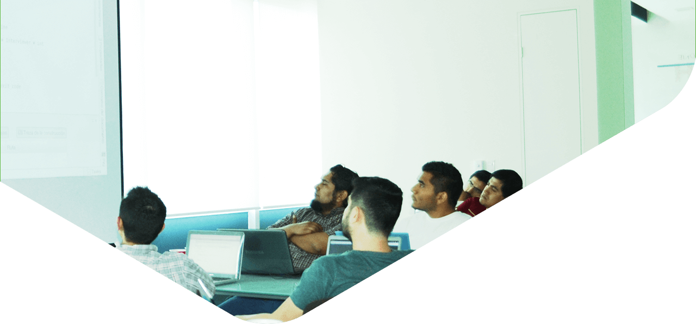
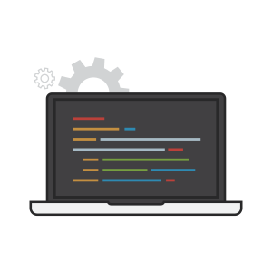

<figure>
  
  <figcaption>
    

      

        

          <h1>Awesome tagline del programa_</h1>
          
Awesome sub header about the program

          <a href="" target="_self" class="btn btn-success">REGÍSTRATE</a>
        

      

    

  </figcaption>
</figure>

  

    

      <!-- Menu lateral -->
      

        <ul class="menu-lateral sticky-scroll-box">
          <li><a href="javascript:$.scrollTo('#programa',800);">Programa</a></li>
          <li><a href="javascript:$.scrollTo('#temario',800);">Temario</a></li>
          <li><a href="javascript:$.scrollTo('#calendario',800);">Calendario</a></li>
          <li><a href="javascript:$.scrollTo('#instructores',800);">Instructores</a></li>
          <li><a href="javascript:$.scrollTo('#colegiatura',800);">Colegiatura</a></li>
          <li><a href="javascript:$.scrollTo('#faq',800);">FAQ</a></li>
          <!-- li><a href="javascript:$.scrollTo('#faq',800);">Registro</a></li> -->
        </ul>
      

      <!-- Contenido -->
      

        <h2>8 semanas intensivas de <b>Web Development_</b></h2>
        
El mejor programa diseñado para pasar de Newbie a desarrollador intermedio en desarrollo de aplicaciones web, usando lenguajes interpretados como Ruby y creando la estructura básica de una aplicación web con base de datos, pasando por pruebas automatizadas hasta lanzándola a la web.

        

          

            
            <h4>Crea tu propia web app</h4>
            
El mejor programa diseñado para pasar de Newbie a desarrollador intermedio en desarrollo de aplicaciones web, usando lenguajes interpretados como Ruby.

          

          

            
            <h4>Testing + Integracion Continua</h4>
            
El mejor programa diseñado para pasar de Newbie a desarrollador intermedio en desarrollo de aplicaciones web, usando lenguajes interpretados como Ruby.

          

        

        

          

            
            <h4>Diseña e implementa APIs</h4>
            
El mejor programa diseñado para pasar de Newbie a desarrollador intermedio en desarrollo de aplicaciones web, usando lenguajes interpretados como Ruby.

          

          

            
            <h4>Sube tu app a cloud servers</h4>
            
El mejor programa diseñado para pasar de Newbie a desarrollador intermedio en desarrollo de aplicaciones web, usando lenguajes interpretados como Ruby.

          

        

        

          

            <b>Experiencia previa recomendada:</b>
             
            Tener fundamentos de programación en cualquier lenguaje orientado a objetos.
          

        

      

    

  

<!-- TEMARIO -->

  

    

      

        <h2>TEMARIO <b>POR SEMANA_</b></h2>
        

          

            

              

                

                <h3><b>Semana 1</b></h3>
                <ul>
                  <li>Lorem ipsum dolor sit amet, consectetur adipiscing elit.</li>
                  <li>Nulla quam velit, vulputate eu pharetra nec, mattis ac neque.</li>
                  <li>Duis vulputate commodo lectus, ac blandit elit tincidunt id.</li>
                </ul>
              

            

          

          

            

              

                

                <h3><b>Semana 2</b></h3>
                <ul>
                  <li>Lorem ipsum dolor sit amet, consectetur adipiscing elit.</li>
                  <li>Nulla quam velit, vulputate eu pharetra nec, mattis ac neque.</li>
                  <li>Duis vulputate commodo lectus, ac blandit elit tincidunt id.</li>
                </ul>
              

            

          

          

            

              

                

                <h3><b>Semana 3</b></h3>
                <ul>
                  <li>Lorem ipsum dolor sit amet, consectetur adipiscing elit.</li>
                  <li>Nulla quam velit, vulputate eu pharetra nec, mattis ac neque.</li>
                  <li>Duis vulputate commodo lectus, ac blandit elit tincidunt id.</li>
                </ul>
              

            

          

        

        

          

            

              

                

                <h3><b>Semana 1</b></h3>
                <ul>
                  <li>Lorem ipsum dolor sit amet, consectetur adipiscing elit.</li>
                  <li>Nulla quam velit, vulputate eu pharetra nec, mattis ac neque.</li>
                  <li>Duis vulputate commodo lectus, ac blandit elit tincidunt id.</li>
                </ul>
              

            

          

          

            

              

                

                <h3><b>Semana 2</b></h3>
                <ul>
                  <li>Lorem ipsum dolor sit amet, consectetur adipiscing elit.</li>
                  <li>Nulla quam velit, vulputate eu pharetra nec, mattis ac neque.</li>
                  <li>Duis vulputate commodo lectus, ac blandit elit tincidunt id.</li>
                </ul>
              

            

          

          

            

              

                

                <h3><b>Semana 3</b></h3>
                <ul>
                  <li>Lorem ipsum dolor sit amet, consectetur adipiscing elit.</li>
                  <li>Nulla quam velit, vulputate eu pharetra nec, mattis ac neque.</li>
                  <li>Duis vulputate commodo lectus, ac blandit elit tincidunt id.</li>
                </ul>
              

            

          

        

      

    

  

<!-- CALENDARIO -->

  

    

      

        <h2>CALENDARIO <b>Y FECHAS IMPORTANTES_</b></h2>
      

      

        

          

            

              

                

                  

                     <h4 class="dia">14</h4>
                  

                  

                     <h4>Agosto</h4>
                     
Inician inscripciones.

                  

                

              

            

          

          

            

              

                

                  

                     <h4 class="dia">15</h4>
                  

                  

                     <h4>Septiembre</h4>
                     
Sesiones de preparación.

                  

                

              

            

          

          

            

              

                

                  

                     <h4 class="dia">3</h4>
                  

                  

                     <h4>Octubre</h4>
                     
Arranque del programa.

                  

                

              

            

          

        

        

          

            

              

                

                  

                     <h4 class="dia">18</h4>
                  

                  

                     <h4>Noviembre</h4>
                     
Hack week.

                  

                

              

            

          

          

            

              

                

                  

                     <h4 class="dia">5</h4>
                  

                  

                     <h4>Diciembre</h4>
                     
Graduación.

                  

                

              

            

          

          

            <!-- 

              

                

                  

                     <h4 class="dia">5</h4>
                  

                  

                     <h4>Diciembre</h4>
                     
Inician inscripciones.

                  

                

              

            
 -->
          

        

      

    

  

<!-- TESTIMONIALES -->

  

    

      

        

          

            

              
              <i>"<b>Hacker School Monterrey</b> es la escuela de software con los mejores programas y mentores de Monterrey para que aprendas a desarrollar software moderno como un verdadero arte."</i>
              <svg width="80" height="80" viewBox="0 0 80 80"  class="alumno">
                <clipPath id="clip-path">
                    <path d="M4.6,22.8c0-1.8,1.3-4,2.8-4.9L37.2,0.7c1.6-0.9,4.1-0.9,5.7,0l29.8,17.2c1.6,0.9,2.8,3.1,2.8,4.9v34.4
  c0,1.8-1.3,4-2.8,4.9L42.9,79.3c-1.6,0.9-4.1,0.9-5.7,0L7.5,62.1c-1.6-0.9-2.8-3.1-2.8-4.9V22.8z"/>
                </clipPath>
                <image clip-path="url(#clip-path)" xlink:href="images/adrian.jpg"  src="images/adrian.jpg" alt="Image" height="80" width="80"/>
              </svg>
              
<b>Adrían Cuadros</b>  Alumno 2016

            

          

        

        

          

            

              
              <i>"<b>Hacker School Monterrey</b> es la escuela de software con los mejores programas y mentores de Monterrey para que aprendas a desarrollar software moderno como un verdadero arte."</i>
              <svg width="80" height="80" viewBox="0 0 80 80"  class="alumno">
                <clipPath id="clip-path">
                    <path d="M4.6,22.8c0-1.8,1.3-4,2.8-4.9L37.2,0.7c1.6-0.9,4.1-0.9,5.7,0l29.8,17.2c1.6,0.9,2.8,3.1,2.8,4.9v34.4
  c0,1.8-1.3,4-2.8,4.9L42.9,79.3c-1.6,0.9-4.1,0.9-5.7,0L7.5,62.1c-1.6-0.9-2.8-3.1-2.8-4.9V22.8z"/>
                </clipPath>
                <image clip-path="url(#clip-path)" xlink:href="images/adrian.jpg"  src="images/adrian.jpg" alt="Image" height="80" width="80"/>
              </svg>
              
<b>Adrían Cuadros</b>  Alumno 2016

            

          

        

        

          

            

              
              <i>"<b>Hacker School Monterrey</b> es la escuela de software con los mejores programas y mentores de Monterrey para que aprendas a desarrollar software moderno como un verdadero arte."</i>
              <svg width="80" height="80" viewBox="0 0 80 80"  class="alumno">
                <clipPath id="clip-path">
                    <path d="M4.6,22.8c0-1.8,1.3-4,2.8-4.9L37.2,0.7c1.6-0.9,4.1-0.9,5.7,0l29.8,17.2c1.6,0.9,2.8,3.1,2.8,4.9v34.4
  c0,1.8-1.3,4-2.8,4.9L42.9,79.3c-1.6,0.9-4.1,0.9-5.7,0L7.5,62.1c-1.6-0.9-2.8-3.1-2.8-4.9V22.8z"/>
                </clipPath>
                <image clip-path="url(#clip-path)" xlink:href="images/adrian.jpg"  src="images/adrian.jpg" alt="Image" height="80" width="80"/>
              </svg>
              
<b>Adrían Cuadros</b>  Alumno 2016

            

          

        

      

    

  

  <!-- INSTRUCTORES -->
  

    

      

        

          

            <h2><b>INSTRUCTORES_</b></h2>
          

        

        

          

            

              

                <h3>Nombre Instructor</h3>
                
Lead Dev @Company

                <ul class="social-dev">
                  <li>
                    
                  </li>
                  <li>
                    
                  </li>
                </ul>
                <svg width="100" height="100" viewBox="0 0 100 100" class="instructor">
                  <clipPath id="clip-path">
                      <path d="M5.8,28.5c0-2.3,1.6-5,3.5-6.1L46.5,0.8c1.9-1.1,5.1-1.1,7.1,0l37.2,21.5c1.9,1.1,3.5,3.9,3.5,6.1v43
  c0,2.3-1.6,5-3.5,6.1L53.6,99.2c-1.9,1.1-5.1,1.1-7.1,0L9.3,77.6c-1.9-1.1-3.5-3.9-3.5-6.1V28.5z"/>
                  </clipPath>
                  <image clip-path="url(#clip-path)" xlink:href="images/adrian.jpg"  src="images/adrian.jpg" alt="Image" height="100" width="100"/>
                </svg>
              

            

          

          

            

              

                <h3>Nombre Instructor</h3>
                
Lead Dev @Company

                <ul class="social-dev">
                  <li>
                    
                  </li>
                  <li>
                    
                  </li>
                </ul>
                <svg width="100" height="100" viewBox="0 0 100 100" class="instructor">
                  <clipPath id="clip-path">
                      <path d="M5.8,28.5c0-2.3,1.6-5,3.5-6.1L46.5,0.8c1.9-1.1,5.1-1.1,7.1,0l37.2,21.5c1.9,1.1,3.5,3.9,3.5,6.1v43
  c0,2.3-1.6,5-3.5,6.1L53.6,99.2c-1.9,1.1-5.1,1.1-7.1,0L9.3,77.6c-1.9-1.1-3.5-3.9-3.5-6.1V28.5z"/>
                  </clipPath>
                  <image clip-path="url(#clip-path)" xlink:href="images/adrian.jpg"  src="images/adrian.jpg" alt="Image" height="100" width="100"/>
                </svg>
              

            

          

          

            

              

                <h3>Nombre Instructor</h3>
                
Lead Dev @Company

                <ul class="social-dev">
                  <li>
                    
                  </li>
                  <li>
                    
                  </li>
                </ul>
                <svg width="100" height="100" viewBox="0 0 100 100" class="instructor">
                  <clipPath id="clip-path">
                      <path d="M5.8,28.5c0-2.3,1.6-5,3.5-6.1L46.5,0.8c1.9-1.1,5.1-1.1,7.1,0l37.2,21.5c1.9,1.1,3.5,3.9,3.5,6.1v43
  c0,2.3-1.6,5-3.5,6.1L53.6,99.2c-1.9,1.1-5.1,1.1-7.1,0L9.3,77.6c-1.9-1.1-3.5-3.9-3.5-6.1V28.5z"/>
                  </clipPath>
                  <image clip-path="url(#clip-path)" xlink:href="images/adrian.jpg"  src="images/adrian.jpg" alt="Image" height="100" width="100"/>
                </svg>
              

            

          

        

      

    

  

  <!-- COLEGIATURA -->
  

    

      

        

          

            <h2><b>COLEGIATURA_</b></h2>
          

          

            <h3>$16,0000 MXN</h3>
            
Una vez recibida tu carta de invitación, el depósito para separar tu lugar será de $5k.

            <a href="{{site.baseurl}}/" class="btn btn-success" role="button">REGÍSTRATE</a>
          

          

            <h4>Opciones de Financiamiento</h4>
            
Lorem ipsum dolor sit amet, consectetur adipiscing elit. Nulla quam velit, vulputate eu pharetra nec, mattis ac neque.

            <h4 class="metodos">Métodos de pago</h4>
            
Lorem ipsum dolor sit amet, consectetur adipiscing elit. Nulla quam velit, vulputate eu pharetra nec, mattis ac neque.

          

        

      

    

  

  <!-- FAQS -->
  

    

      

        

          

            <h2><b>FAQS_</b></h2>
          

          

            

              

                

                  <h4 class="panel-title">
                    <a role="button" data-toggle="collapse" data-parent="#accordion" href="#collapseOne" aria-expanded="true" aria-controls="collapseOne">
                      ¿Necesito llevar mi computadora?
                    </a>
                  </h4>
                

                

                  

                    Anim pariatur cliche reprehenderit, enim eiusmod high life accusamus terry richardson ad squid. 3 wolf moon officia aute, non cupidatat skateboard dolor brunch. Food truck quinoa nesciunt laborum eiusmod. Brunch 3 wolf moon tempor, sunt aliqua put a bird on it squid single-origin coffee nulla assumenda shoreditch et. Nihil anim keffiyeh helvetica, craft beer labore wes anderson cred nesciunt sapiente ea proident. Ad vegan excepteur butcher vice lomo. Leggings occaecat craft beer farm-to-table, raw denim aesthetic synth nesciunt you probably haven't heard of them accusamus labore sustainable VHS.
                  

                

              

              

                

                  <h4 class="panel-title">
                    <a class="collapsed" role="button" data-toggle="collapse" data-parent="#accordion" href="#collapseTwo" aria-expanded="false" aria-controls="collapseTwo">
                      ¿En dónde serán las sesiones presenciales?
                    </a>
                  </h4>
                

                

                  

                    Anim pariatur cliche reprehenderit, enim eiusmod high life accusamus terry richardson ad squid. 3 wolf moon officia aute, non cupidatat skateboard dolor brunch. Food truck quinoa nesciunt laborum eiusmod. Brunch 3 wolf moon tempor, sunt aliqua put a bird on it squid single-origin coffee nulla assumenda shoreditch et. Nihil anim keffiyeh helvetica, craft beer labore wes anderson cred nesciunt sapiente ea proident. Ad vegan excepteur butcher vice lomo. Leggings occaecat craft beer farm-to-table, raw denim aesthetic synth nesciunt you probably haven't heard of them accusamus labore sustainable VHS.
                  

                

              

              

                

                  <h4 class="panel-title">
                    <a class="collapsed" role="button" data-toggle="collapse" data-parent="#accordion" href="#collapseThree" aria-expanded="false" aria-controls="collapseThree">
                      ¿Qué experiencia previa necesito?
                    </a>
                  </h4>
                

                

                  

                    Anim pariatur cliche reprehenderit, enim eiusmod high life accusamus terry richardson ad squid. 3 wolf moon officia aute, non cupidatat skateboard dolor brunch. Food truck quinoa nesciunt laborum eiusmod. Brunch 3 wolf moon tempor, sunt aliqua put a bird on it squid single-origin coffee nulla assumenda shoreditch et. Nihil anim keffiyeh helvetica, craft beer labore wes anderson cred nesciunt sapiente ea proident. Ad vegan excepteur butcher vice lomo. Leggings occaecat craft beer farm-to-table, raw denim aesthetic synth nesciunt you probably haven't heard of them accusamus labore sustainable VHS.
                  

                

              

              

                

                  <h4 class="panel-title">
                    <a class="collapsed" role="button" data-toggle="collapse" data-parent="#accordion" href="#collapseFour" aria-expanded="false" aria-controls="collapseFour">
                      ¿Qué experiencia previa necesito?
                    </a>
                  </h4>
                

                

                  

                    Anim pariatur cliche reprehenderit, enim eiusmod high life accusamus terry richardson ad squid. 3 wolf moon officia aute, non cupidatat skateboard dolor brunch. Food truck quinoa nesciunt laborum eiusmod. Brunch 3 wolf moon tempor, sunt aliqua put a bird on it squid single-origin coffee nulla assumenda shoreditch et. Nihil anim keffiyeh helvetica, craft beer labore wes anderson cred nesciunt sapiente ea proident. Ad vegan excepteur butcher vice lomo. Leggings occaecat craft beer farm-to-table, raw denim aesthetic synth nesciunt you probably haven't heard of them accusamus labore sustainable VHS.
                  

                

              

              

                

                  <h4 class="panel-title">
                    <a class="collapsed" role="button" data-toggle="collapse" data-parent="#accordion" href="#collapseFive" aria-expanded="false" aria-controls="collapseFive">
                      ¿Qué experiencia previa necesito?
                    </a>
                  </h4>
                

                

                  

                    Anim pariatur cliche reprehenderit, enim eiusmod high life accusamus terry richardson ad squid. 3 wolf moon officia aute, non cupidatat skateboard dolor brunch. Food truck quinoa nesciunt laborum eiusmod. Brunch 3 wolf moon tempor, sunt aliqua put a bird on it squid single-origin coffee nulla assumenda shoreditch et. Nihil anim keffiyeh helvetica, craft beer labore wes anderson cred nesciunt sapiente ea proident. Ad vegan excepteur butcher vice lomo. Leggings occaecat craft beer farm-to-table, raw denim aesthetic synth nesciunt you probably haven't heard of them accusamus labore sustainable VHS.
                  

                

              

            

          

        

      

    

  

